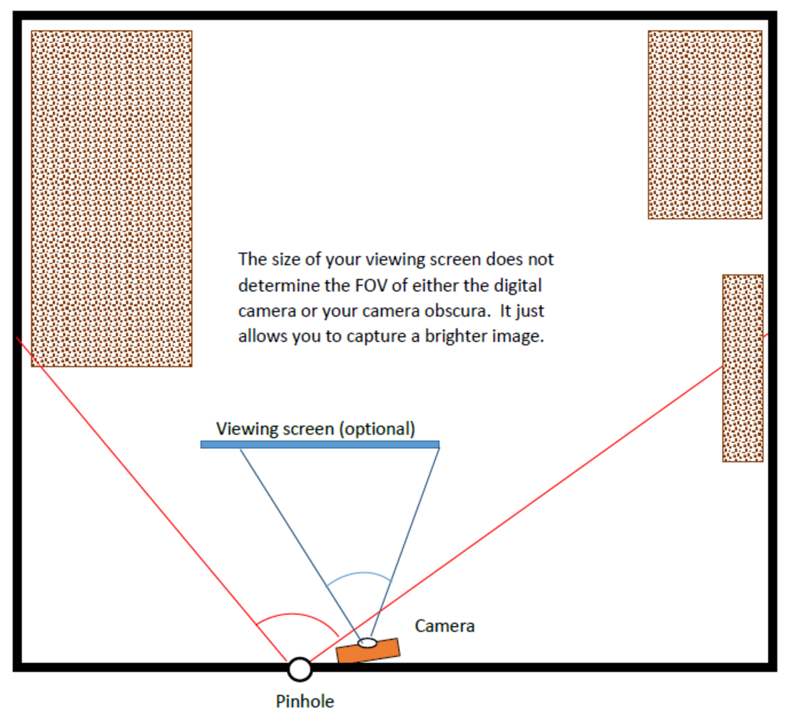

# Camera Obscura

**Important Note:** This assignment is subject to the "Above & Beyond" rule. In summary: meeting all stated requirements will earn 90%; the last 10% is reserved for individual effort to research, implement, and report some additional high-quality work on this topic beyond the minimum requirements. Your A&B work must be accompanied by discussion of the computational photographic concepts involved, and will be graded based on the level of effort, and quality of your results and documentation in the report. (Please review the full explanation of this rule on Piazza.)

## Synopsis

Construct a Camera Obscura (also known as a pin-hole camera), and document the construction and operation of the camera. The camera obscura is the forerunner of modern cameras, as shown in this [drawing of the Arabic scientist Al-Hasan in the 10th century](https://padumedu.files.wordpress.com/2013/12/alhazen.jpg) and in this [17th century manuscript](https://upload.wikimedia.org/wikipedia/commons/8/8a/Camera_obscura2.jpg).

#### General Advice

  - The outside scene should be in bright daylight.
  - Choose a very dark room and relatively small pinhole (ranging from ⅛” to coin sized, depending on room size).
  - Control the light entering the room. (Heavy black plastic, blankets, aluminum foil, and cardboard)
  - If walls have dark paint, or the image is very dim, improvise a white screen closer to the pinhole to reveal the image.
  - Experiment with different pinhole diameters, especially if the image is really dim.
  - Keep  camera still during the entire exposure time (tripod or other mounting). Use  camera’s timer to help - a delay gives time to set the camera and turn off room lights, and removes a source of motion.

#### Examples

  - For discussion of box obscura and some results see http://www.janetneuhauser.com/thoughts-on-lensless-photography/ 

  - This youtube video provides an example of a box obscura https://www.youtube.com/watch?v=NnOTtfkilLc . 

## Overview

This video gives a good overview of the process you will follow: [Making Your Own Room With a View](https://www.youtube.com/watch?v=gvzpu0Q9RTU)

### 1. Build a Camera Obscura

Choose a room in your house (or a closet, or any small enclosed place) into a camera obscura by letting light pass into the room only through a small hole (i.e., the pinhole). Block out all light from windows, doorways, and any other sources, leaving only a small pinhole in one surface. An image of the outside world will be projected onto a wall in your room. The image will be dim but visible to the naked eye (once your eyes acclimate to the darkness) as long as the space is very dark.

You may get help from a friend or family member, but we expect that you will direct the efforts and document what they did to help. Document your efforts by taking pictures, even for setups that fail. These are lessons learned that you should include in your report.

*NOTE:* It is a good idea to let your neighbors know what you are doing. Covering windows with cardboard and foil has occasionally caused consternation. You may share the class website with them: https://www.omscs.gatech.edu/cs-6475-computational-photography

#### Alternative Box Camera Obscura

You must make a serious attempt to building a camera obscura in a room as described above before building a box camera. However, if you cannot use a room, then you may construct a box camera. You must explain in your report why you could not build a room and you will not be penalized.

A box camera obscura can be built using a large cardboard box or other light-proof container. Consider a moving box, paper supply box, or grocery store boxes. If you follow this approach, you will not get the true experience of being inside a camera obscura, but a box can still give very good results. The advantage of this method is portability, so you can make images of a variety of outdoor scenes.

If you choose this approach, investigate how to see the image inside and how to capture a picture of the interior. This is challenging, but there are solutions. In the past, students have achieved good results by taking a picture of the back/side screen of the box with their camera looking through a view-hole cut adjacent to the pinhole -- but the camera location will need light-proofing. Another option is to seal the camera inside the box on a timer or remote control.

If you choose this alternative approach, then make sure that you:

  - Document in your write-up the steps that you took to try the room camera obscura, and/or what prevented you from being successful in using a room for the assignment. This can include lack of suitable location, lighting problems, weather conditions, etc. 

  - Make a light-proof box or container. (This takes care and effort!) You will need to capture the image projected onto the back of the box with the box closed to prevent light leakage. 

  - The image through the pinhole should project onto a solid opaque surface at the back of the box. This means that the light can’t shine through the back of the box. You should place a white screen along the box walls, as images don’t show up well on brown cardboard. 

  - Try various pinhole sizes, but start small for boxes.

  - Capture the building process of your box camera obscura. Take pictures as you go so you can use them in your report.

#### What **NOT** to do (there will be a substantial deduction for any of these):

  - Do NOT build a box camera where you take pictures from behind a translucent screen. This design blurs or “fogs” the image considerably, and generally has substantial light leakage.  An example of this excluded type of camera can be viewed at this youtube video https://www.youtube.com/watch?v=Y0wenfVfHuo. 

  - Do NOT build a pinhole lens for your camera. The simplest way to get a Pinhole Camera for those with a removable lens camera is to just make a small hole in a lens-cover and put it in front of the camera. This IS NOT ACCEPTABLE. The assignment requires a room, or the alternative box/container, where you can make the box into a camera with a screen.

  - Do NOT simply stick the camera through the back of a box camera and photograph the pinhole.

  - Do NOT use a lens for the basic assignment. You may investigate the and compare between pinholes and a lens after using the plain pinhole camera, but you must submit results from a camera obscura with just a pinhole lens.

### 2. Document your work
  
  - Take a picture of the scene outside the window (on the other side of the pinhole) that you are trying to capture (let’s call it the "Scene"). 
  - Take a picture of the image being projected onto your wall or screen (let's call it the "Image") by using a very long exposure (for example, from 8 to 30 seconds).

## Appendix: Field of View

The field of view (FOV) for a camera is an angle (measured in degrees). You can measure the angle with a protractor, or calculate the angle based on measurements in your camera room. Try to make your measurements reasonably accurate.

For the camera obscura, the included angle is measured using the pinhole as the vertex location from the first place that an image is visible on one side of your room or box, to the last place you can view the image on the other side. WMeasure the angle between the last object visible at the two side edges of your image using the camera lens position as the vertex.
